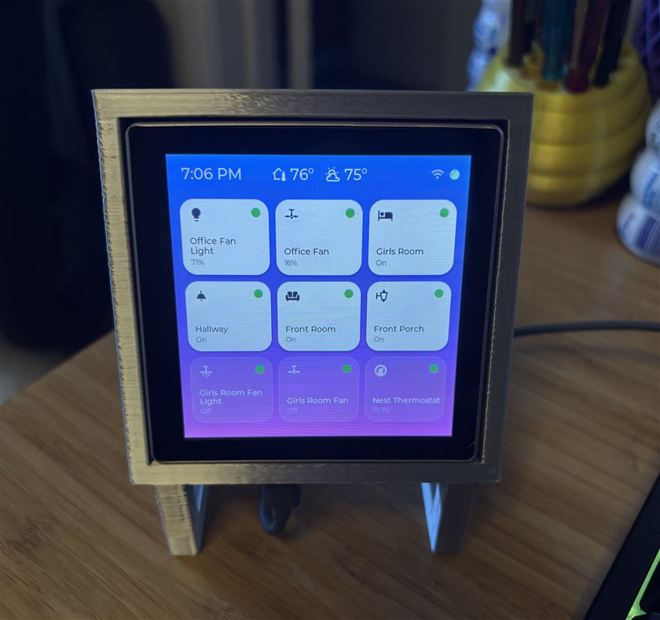

# Tessera

A Home Assistant wall-panel controller for the **Guition ESP32-S3-4848S040** — a 4" 480×480 capacitive-touch display. Tessera shows a grid of device tiles that toggle Home Assistant entities over the WebSocket API, plus indoor/outdoor temperatures and a full thermostat control view.

<p align="center">
  
</p>

## Features

- **3×3 tile grid**, data-driven from a `MOSAIC[]` array in `config.h`
- **Toggle lights / switches / fans** via the HA WebSocket API, with optimistic UI updates
- **Per-tile icons** (Material Design Icons) and **live value text** (brightness %, fan speed %)
- **Availability pips** — green when the entity is reachable, amber when `unavailable`
- **Fan low-start** — optionally turn a fan on at a set speed instead of 100%
- **Header**: live clock + indoor and outdoor temperatures (read from HA, no third-party API)
- **Thermostat control** — tap the thermostat tile for a detail view with current temp, mode (Off/Heat/Cool/Auto) and setpoint +/- (dual setpoints in heat_cool)
- **Swipe paging**, idle dimming, and a wake-touch that only wakes the screen

## Hardware

- Guition ESP32-S3-4848S040 (ESP32-S3-WROOM-1 N16R8, 16 MB flash, 8 MB PSRAM)
- ST7701S RGB display, GT911 capacitive touch
- CH340 USB-serial (appears as a COM port)

## Toolchain

- [PlatformIO](https://platformio.org/) + Arduino framework
- LVGL 8.4, Arduino_GFX, links2004/WebSockets, ArduinoJson (pinned in `platformio.ini`); `TAMC_GT911` is vendored under `lib/` (patched — see [Known setup notes](#known-setup-notes))

## Requirements

Before you start, you'll need:

- **A running Home Assistant instance** on your network, reachable over HTTP
  (default port `8123`) with the WebSocket API enabled (on by default). Tessera is
  a controller — it does **not** run Home Assistant itself.
- **A Home Assistant long-lived access token** (HA → your profile → *Long-Lived
  Access Tokens*) for the panel to authenticate with.
- **The entities you want to control** already configured in Home Assistant —
  lights, switches, fans, a `climate` thermostat, and a `weather` entity for the
  outdoor temperature.
- **A 2.4 GHz WiFi network** — the ESP32-S3 does not support 5 GHz. The panel and
  Home Assistant must be reachable on the same network.
- **A computer with [PlatformIO](https://platformio.org/)** and a USB cable for the
  initial flash (later updates can go over the network via OTA).

## Setup

Configuration is split in two, and **neither file is committed**:

- **Credentials** — WiFi, HA host/port/token, timezone — are gathered by a setup
  wizard and stored in `include/secrets.h`.
- **Devices** — your tiles and the header thermostat/weather entities — live in
  `include/config.h`. This file holds no secrets, so it's safe to share or paste
  into an LLM (see [Adding devices](#adding-devices)).

1. **Install PlatformIO** — the build/flash toolchain. Install either the
   [PlatformIO IDE extension for VS Code](https://platformio.org/install/ide?install=vscode)
   or the command-line core (`pip install platformio`); see
   [platformio.org/install](https://platformio.org/install) for all options.

2. **Connect the panel** to your computer with a **data-capable** USB cable (a
   charge-only cable won't work). It appears as a serial port — `COMx` on Windows,
   `/dev/tty.*` on macOS/Linux — which the wizard auto-detects when it flashes.

3. **Add your devices**
   ```sh
   cp include/config.h.example include/config.h
   ```
   Edit `include/config.h`: list your tiles in `MOSAIC[]` and set the header
   thermostat/weather entities.

4. **Run the setup wizard** (gathers credentials, then flashes)
   ```sh
   python setup_wizard.py
   ```
   It prompts for your WiFi, HA host/port, a **long-lived access token** (it tells
   you where to find it), and timezone (pick from a list); **validates the token
   against your Home Assistant instance** before continuing; writes
   `include/secrets.h`; then offers to flash the panel over USB and confirm it
   connects. Run it with the PlatformIO Python so `pyserial`/`platformio` are
   available — the script header shows the exact path per OS.

   *Prefer to do it by hand?* Copy `include/secrets.h.example` to
   `include/secrets.h`, fill it in, and build with `pio run --target upload` (set
   the correct port in `platformio.ini`).

## Working with an LLM (recommended)

Tessera is built to be configured and extended with an AI coding assistant
(Claude, etc.) — and doing so is genuinely the easiest path. The config and the
code are deliberately self-describing for exactly this.

- **Setup & install** — paste this README and `include/config.h.example` into an
  LLM and describe your setup ("Home Assistant at `192.168.x.x`, these devices…").
  It can fill in `MOSAIC[]`, pick `ICON_*` glyphs, and walk you through running the
  setup wizard (which gathers your token and flashes the panel).
- **Adding or changing devices** — paste your `config.h` and say *"add my garage
  light, entity `switch.garage`."* Every field (`label`, `entity_id`, `page`,
  `on_pct`, `icon`) is commented and the available icons are listed, so the model
  has what it needs to produce a correct `MOSAIC[]` row.
- **Modifying the firmware** — each source file carries a module-header comment
  describing its role and gotchas, so an assistant can orient quickly to make UI
  or behavior changes.
- **Troubleshooting** — share serial output or symptoms; common pitfalls (the
  touch coordinate transform, ArduinoJson filter sizing, HA token / IP-ban) are
  documented in the code and below.

You don't *need* an LLM — everything is editable by hand — but the project is
structured to make AI-assisted setup and extension fast and reliable.

## Adding devices

Tiles are defined in `include/config.h` as rows of the `MOSAIC[]` array. Adding a
device that uses an existing icon needs no firmware changes — just a new row, a
rebuild, and a flash. Each row has five fields:

| Field | Meaning |
|---|---|
| `label` | Text shown under the icon (keep short — ~14 chars fits) |
| `entity_id` | The Home Assistant entity, e.g. `light.kitchen`. Tapping the tile toggles it. |
| `page` | Which screen the tile is on (0-based). Up to 9 tiles per page (3×3); swipe left/right to change pages. |
| `on_pct` | `0` for a plain toggle. For a fan, a value `>0` makes "turn on" start at that % speed instead of 100% (e.g. `16.67` ≈ the lowest of 6 speeds). |
| `icon` | An `ICON_*` name from the catalog at the top of `config.h`. |

Example — add a garage light on the first page:

```c
static const Tessera MOSAIC[] = {
  // ...existing tiles...
  { "Garage", "switch.garage", 0, 0, ICON_LIGHTBULB },
};
```

Then rebuild and flash (`pio run --target upload`). The entity must already exist
in Home Assistant.

**Easiest path:** paste your `config.h` into an LLM and say *"add my garage light,
entity `switch.garage`."* The file documents every field and lists every available
icon, so the model has what it needs to produce a correct row.

## Icons

Tile/header icons come from a generated LVGL font (`src/mdi_icons.c`) built from
[Material Design Icons](https://pictogrammers.com/library/mdi/). The font is
committed, so a normal build needs no extra steps. The `ICON_*` names at the top
of `config.h` are the **complete catalog** — only those glyphs are compiled in.

To add a glyph that isn't in the catalog:

1. Find the icon at [pictogrammers.com/library/mdi](https://pictogrammers.com/library/mdi/)
   and note its hex codepoint (e.g. `F0335`).
2. From `tools/`, install the tooling once, then regenerate the font with your new
   codepoint **appended** to the existing `--range` list:
   ```sh
   cd tools
   npm install            # once — fetches @mdi/font + lv_font_conv
   npx lv_font_conv \
     --font node_modules/@mdi/font/fonts/materialdesignicons-webfont.ttf \
     --size 26 --bpp 4 --format lvgl --no-compress --no-kerning \
     --lv-include lvgl.h -o ../src/mdi_icons.c \
     --range 0xF0335,0xF1797,0xF02E3,0xF0769,0xF04B9,0xF1020,0xF1798,0xF0F55,0xF0595,0xF0393,0xF0XXX
   ```
   (Keep every existing codepoint; just add yours as `0xF0XXX`.)
3. Add a matching define in `config.h` and use it in a tile. The glyph is a UCN
   with the codepoint zero-padded to 8 hex digits — e.g. `F0608` becomes:
   ```c
   #define ICON_GARAGE "\U000F0608"   // garage
   ```

## Known setup notes

- **GT911 patch**: the upstream `TAMC_GT911` library calls `pinMode()` on the
  INT/RST pins even when they're unused (`-1`), which on this board logs
  `Invalid IO 255`. A patched copy is **vendored under `lib/TAMC_GT911`** (the
  INT/RST pin operations in `reset()` are guarded), so a fresh `git clone` + build
  works with no manual patching — and it is intentionally **not** in `lib_deps`, so
  a dependency install can't overwrite it. See `lib/TAMC_GT911/PATCH.md`.
- Serial output requires `ARDUINO_USB_CDC_ON_BOOT=0` (already set in `platformio.ini`)
  so logging goes to the CH340 UART rather than native USB-CDC.

## Project layout

```
src/             main, display, touch, ui, ha_client, mdi_icons (generated font)
include/         config.h.example (devices), secrets.h.example (credentials), lv_conf.h
tools/           icon-font generation (@mdi/font + lv_font_conv)
setup_wizard.py  first-run credential wizard — writes include/secrets.h, flashes
serial_read.py   serial-monitor helper (reads the boot log over USB)
platformio.ini, partitions_16MB_ota.csv
```

## License

[MIT](LICENSE).
